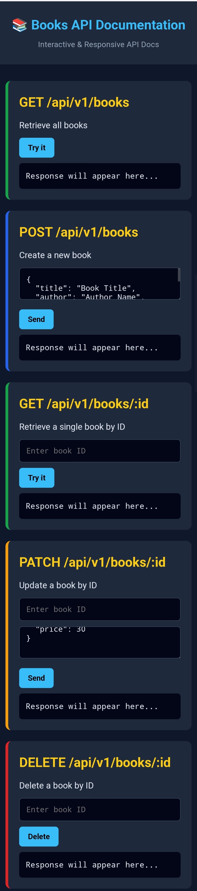

# 📚 Book Management System (Full-Stack API)

A professional, full-stack library management application built with **Node.js** and **Express.js**. This project implements a clean **Repository Pattern** and features a built-in **Interactive API Playground** for real-time testing and documentation.

---

## 🚀 Project Preview

Below is a screenshot of the interactive API documentation and the development environment:



---

## ✨ Architectural Excellence

- **Repository Pattern:** Decouples business logic from data access logic, making the system database-agnostic and highly maintainable.
- **Centralized Error Handling:** Robust exception management using a custom `AppError` class and global error middleware.
- **Interactive API Playground:** A custom-built interface served statically, allowing users to test endpoints directly from the browser.
- **Validation Pipeline:** Request body validation (`checkBody`) and resource existence verification (`checkID`) via specialized middleware.
- **Modern JavaScript:** Fully utilizes ES Modules, async/await, and the native crypto module for secure UUID generation.

---

## 🛠️ Tech Stack

### Backend

- **Node.js:** Runtime environment.
- **Express.js:** Web framework.
- **fs/promises:** Non-blocking File System operations for JSON storage.

### Frontend (Built-in Docs)

- **HTML5 & CSS3:** Modern, responsive Dark Mode interface.
- **Vanilla JavaScript:** Fetch API for seamless client-server interaction.

---

## 🔌 API Documentation

### 📋 Data Model (Schema)

| Field | Type | Description | Required |
| :--- | :--- | :--- | :--- |
| **id** | `UUID` | Unique identifier (Auto-generated) | ✅ |
| **title** | `String` | Book title | ✅ |
| **author** | `String` | Author's name | ✅ |
| **genre** | `String` | Book category | ❌ |
| **year** | `Number` | Year of publication | ❌ |
| **available** | `Boolean` | Availability status | ❌ |

### 🛣️ Endpoints Reference

| Method | Endpoint | Description | Middleware |
| :--- | :--- | :--- | :--- |
| **GET** | `/api/v1/books` | Get all books | — |
| **POST** | `/api/v1/books` | Create a new book | `checkBody` |
| **GET** | `/api/v1/books/:id` | Get book by ID | `checkID` |
| **PATCH** | `/api/v1/books/:id` | Update book details | `checkID`, `checkBody` |
| **DELETE** | `/api/v1/books/:id` | Remove a book | `checkID` |

---

## 📁 Project Structure

```text
├── server.js           # Entry point
├── app.js              # Express config
├── routes/             # Route definitions
├── controllers/        # Request handling logic
├── repository/         # Data Access Layer (Repository Pattern)
├── utils/              # AppError & helpers
├── public/             # Static UI (HTML/CSS)
└── dev-data/           # JSON database storage

---

## 🚀 Future Roadmap: Version 2.0

The architecture is already **Database-Agnostic**, which makes the transition seamless. The next planned milestones are:

- [ ] **Migration to MongoDB:** Replace `fs` logic in `bookRepository.js` with Mongoose models.
- [ ] **Advanced Queries:** Implement filtering, sorting, and pagination for the books collection.
- [ ] **Security Layer:** Add User Authentication and Authorization using **JWT**.
- [ ] **Input Sanitization:** Add deeper security middleware to prevent NoSQL injection.

---

### 📥 Installation & Setup

1. **Clone the repository:**
   ```bash
   git clone [https://github.com/MajidRS/Simple-Library-Management-System-API.git](https://github.com/MajidRS/Simple-Library-Management-System-API.git)

2. **Install Dependencies:**
   ```bash
   npm install

2. **Run the Server:**
   ```bash
   node server.js

---

## 👨‍💻 Developed By

**Hadji Abdelmadjid** *Junior Node.js Backend Developer*

> "Building efficient and scalable backend systems with passion."

